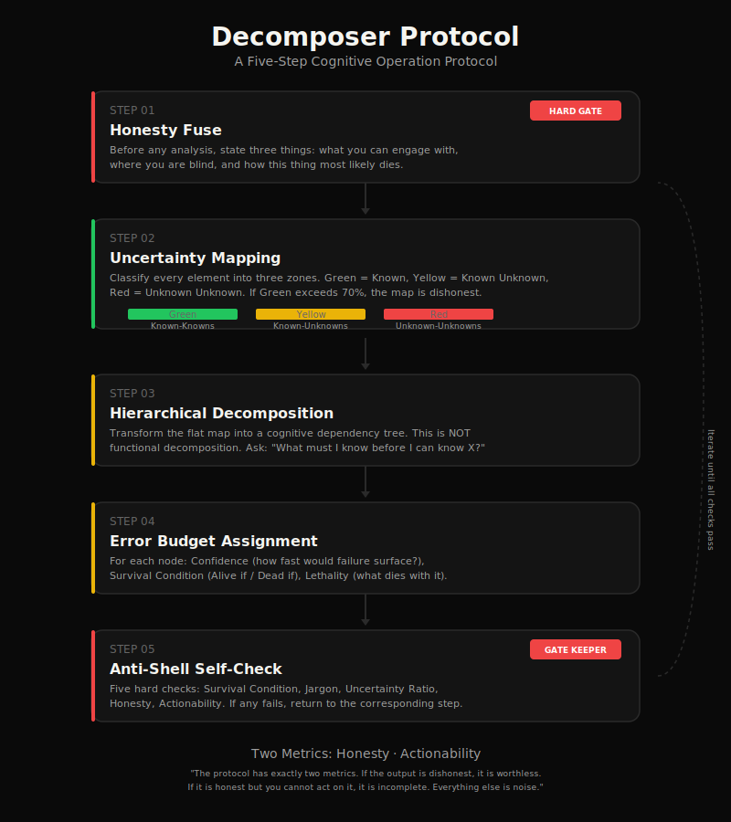

<p align="center">
  
</p>

<p align="center">
  <strong>A cognitive operation protocol for transforming unknown unknowns into known unknowns.</strong>
</p>

<p align="center">
  <em>Honest. Actionable. Domain-agnostic.</em>
</p>

<p align="center">
  <a href="#"></a>
  <a href="#"></a>
  <a href="#"></a>
  <a href="#"></a>
  <a href="#"></a>
</p>

---

<br>

## The Problem

Every AI-generated plan is a lie.

Not a malicious lie. Not a deliberate deception. But a lie nonetheless — a polished module list that mimics the shape of understanding without any of the substance. "User management. Payment system. Recommendation engine." It looks structured. It looks comprehensive. It is a **shell**.

The shell looks like progress. It feels like clarity. But the moment you try to act on it, you hit a wall that was invisible in the plan — a dependency nobody mentioned, an assumption that was false, a constraint that makes the entire architecture untenable.

The plan didn't warn you because the plan never saw the wall. It wasn't looking.

**Decomposer exists to force the wall into visibility before you walk into it.**

<br>

## The Core Claim

> **The fundamental unit of progress is not a feature, a module, or a milestone.**
> **It is the conversion of one unknown unknown into a known unknown.**

An unknown unknown is something you didn't even know you didn't know — a hidden dependency, an invisible assumption, a failure mode you can't imagine yet. A known unknown is a question you can name but cannot yet answer. "Will users pay for this?" "Does the math support this approach?"

The entire purpose of the Decomposer Protocol is to perform this conversion, ruthlessly and repeatedly, until what remains is a structure where every piece has a survival condition, every claim can be tested, and every gap is explicitly owned.

<br>

## The Protocol in One Image

<p align="center">
  
</p>

<br>

## Quick Start: 30 Seconds

```bash
# 1. Read the protocol
cat PROTOCOL.md

# 2. Pick a problem — anything large, ambiguous, or scary
# 3. Run the 5 steps in your head (or on a whiteboard)
# 4. The output is an actionable uncertainty map
# 5. Everything has a survival condition. Nothing is hidden.
```

**No installation. No dependencies. No AI required.**

The protocol runs in your head, on a whiteboard, or in a conversation. The AI skill (TRAE adapter) is a convenience, not a requirement. See `adapters/human/` for the pen-and-paper version.

<br>

## The Five Steps

| Step | What It Does | Why It Matters |
|------|-------------|----------------|
| **1. Honesty Fuse** 🚨 | State your limits before any analysis | Prevents the "shell" from forming |
| **2. Uncertainty Mapping** 🗺️ | Classify every element as Green/Yellow/Red | Makes the invisible visible |
| **3. Hierarchical Decomposition** 🌳 | Build a cognitive dependency tree | Reveals what must be known first |
| **4. Error Budget** 📊 | Assign confidence, survival condition, lethality | Every node can be tested or killed |
| **5. Anti-Shell Self-Check** 🔍 | Five hard checks. Iterate until all pass. | Guarantees honesty and actionability |

**Two metrics**: Honesty and Actionability. If the output is dishonest, it is worthless. If it is honest but you cannot act on it, it is incomplete. Everything else is noise.

<br>

## Standard AI Plan vs. Decomposer Output

```
┌─────────────────────────────────────┬────────────────────────────────────────┐
│         Standard AI Plan           │         Decomposer Output              │
├─────────────────────────────────────┼────────────────────────────────────────┤
│ "We need user authentication."     │ "User auth — Alive if: 50 users        │
│  (no caveats, no conditions)       │             register in week 1.         │
│                                     │  Dead if: >10% login failures.         │
│                                     │  Confidence: High (fast detection)."   │
├─────────────────────────────────────┼────────────────────────────────────────┤
│ "We'll implement a recommendation  │ "Recommendation engine — YELLOW zone.  │
│  engine. (sounds confident)"       │  I don't know if collaborative         │
│                                     │  filtering works here. Need 100 users  │
│                                     │  of behavior data to test."            │
├─────────────────────────────────────┼────────────────────────────────────────┤
│ "Then we scale. (hand-wave)"       │ "Scale — RED zone. I cannot see the    │
│                                     │  failure mode. This is a blind spot.   │
│                                     │  First probe: load test with 1000      │
│                                     │  concurrent users."                    │
└─────────────────────────────────────┴────────────────────────────────────────┘
```

<br>

## Platform Adapters

The protocol is universal. Its rendering is contextual.

| Adapter | Path | Purpose |
|---------|------|---------|
| 🤖 **TRAE** | [`adapters/trae/`](adapters/trae/) | AI-assistant conversation integration |
| 🐦 **Twitter** | [`adapters/twitter/`](adapters/twitter/) | Long-form essay structural template |
| 👥 **Team** | [`adapters/team/`](adapters/team/) | Decision-friendly meeting brief |
| 🧠 **Human** | [`adapters/human/`](adapters/human/) | Pen-and-paper physical checklist |

<br>

## Read These Files

| File | What It Is |
|------|-----------|
| [`MANIFEST.md`](MANIFEST.md) | Philosophy and commitment (~800 words). Start here. |
| [`PROTOCOL.md`](PROTOCOL.md) | The full five-step protocol (~3500 words). The core. |
| [`FIELD_GUIDE.md`](FIELD_GUIDE.md) | Application annotations. How the protocol surfaces. |
| [`SKILL.md`](SKILL.md) | Platform-agnostic skill definition. |
| [`references/`](references/) | Shared reference files (position routing, output rules, checklist). |

<br>

## The Commitment

> If the best we can deliver is three honest nodes with survival conditions — three pieces of the problem that are genuinely understood and genuinely actionable — that is superior to a fifty-page plan where every module is a placeholder in disguise.

> The fifty-page plan gives you the feeling of progress. The three honest nodes give you the *fact* of progress. The feeling evaporates on contact with reality. The fact survives.

<br>

## License

MIT — use it, fork it, remix it, ship it. The protocol is free. The honesty is the point.

<br>

---

<p align="center">
  <strong>Stop building shells. Start decomposing.</strong>
  <br><br>
  <a href="https://twitter.com/intent/tweet?text=Decomposer%20-%20A%20cognitive%20protocol%20for%20turning%20unknown%20unknowns%20into%20known%20unknowns.%20No%20AI%20required.%20Just%20honesty.&url=https://github.com/chkev/Decomposer-Skill">Share on X/Twitter</a>
  &nbsp;·&nbsp;
  <a href="https://github.com/chkev/Decomposer-Skill">GitHub</a>
</p>